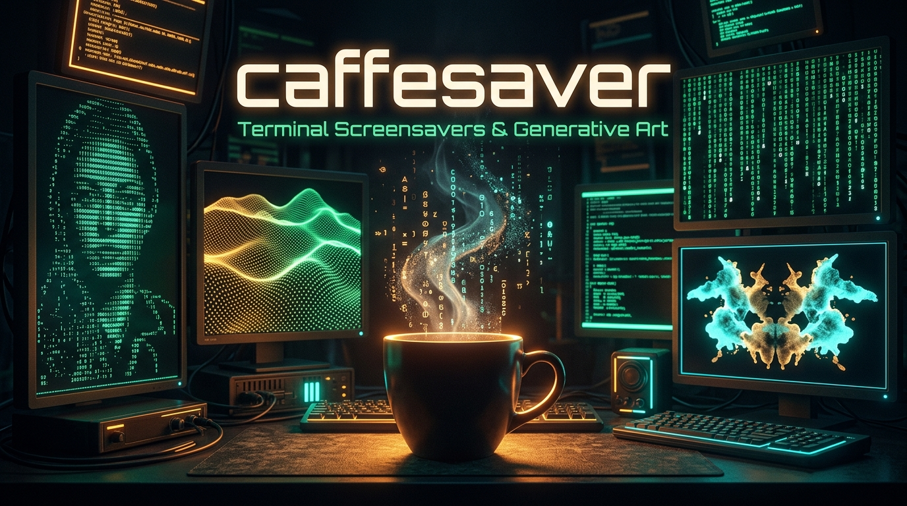
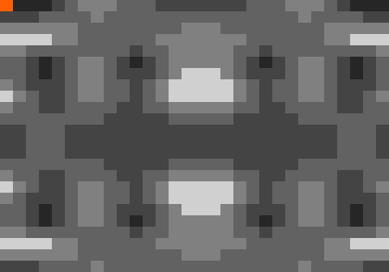
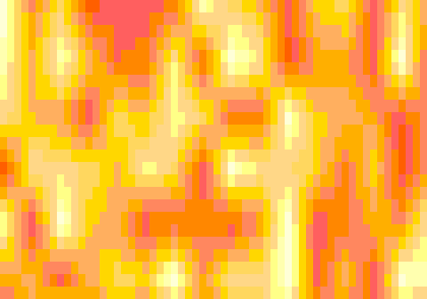
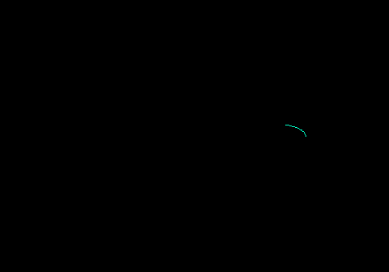
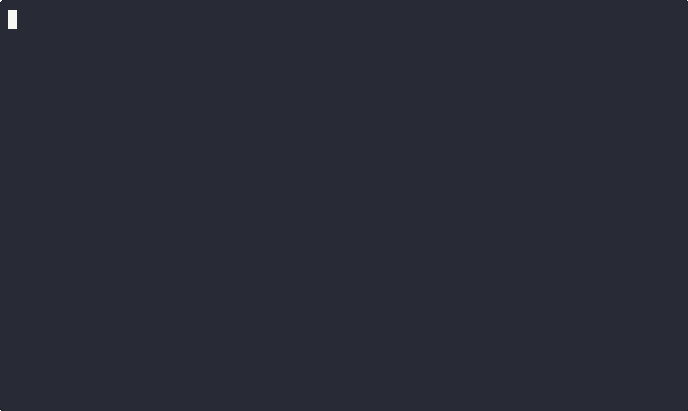

# ☕ caffesaver

<p align="center">
  
</p>

<p align="center">
  <strong>A curated collection of animated terminal screensavers and generative ASCII/ANSI art.</strong><br>
  <em>Featuring ultra-fast native C visualizers, seamless pure Bash fallback, and macOS caffeinate anti-sleep protection.</em>
</p>

<p align="center">
  <a href="https://github.com/Duccioo/caffesaver/releases"></a>
  <a href="./LICENSE"></a>
  
  
  = 3.2" />
  
  
</p>

---

## 📑 Table of Contents

- [✨ Key Features](#-key-features)
- [🎬 Visual Previews](#-visual-previews)
- [🍺 Installation via Homebrew (macOS & Linux)](#-installation-via-homebrew-macos--linux)
- [🚀 Quickstart & Manual Install](#-quickstart--manual-install)
- [💻 Command-Line Usage](#-command-line-usage)
- [🏛️ The Gallery (18 Screensavers)](#️-the-gallery-18-screensavers)
- [🛠️ Project Structure](#️-project-structure)
- [🎨 Creating a New Screensaver](#-creating-a-new-screensaver)
- [🧪 Testing (The Jury)](#-testing-the-jury)
- [🤝 Contributing](#-contributing)
- [📄 License](#-license)

---

## ✨ Key Features

* **⚡ Native C Performance at 60 FPS:** Computationally intensive visualizers (`rorschach-led`, `dunes`, `matrix`, `perlin-ascii`, `perlin-pixel`) feature native **C engines** compiled with `-O3` optimizations for silky smooth 60 FPS rendering with < 1% CPU usage.
* **🔄 Transparent JIT Auto-Compilation:** When launching any visualizer, `caffesaver` automatically detects available compilers (`clang`, `gcc`, or `cc`) and builds the binary on the first run (`.bin`).
* **🐚 Zero-Dependency Pure Bash Fallback:** No C compiler installed? No problem. Every visualizer includes a pure `bash` fallback implementation ensuring it runs everywhere out of the box.
* **☕ macOS Anti-Sleep (`caffeinate`):** Automatically wraps screensaver execution with `caffeinate -d` on macOS to prevent display dimming and screen sleep while your terminal artwork runs.
* **🖥️ Non-Destructive Terminal Safety:** Utilizes the terminal's **Alternate Screen Buffer** (`tput smcup` / `tput rmcup`). Your original command history and shell prompt are completely restored upon exit.
* **🛡️ Graceful Signal Trapping:** Handles `Ctrl+C` (`SIGINT`), `SIGTERM`, and window resizing gracefully, ensuring cursor visibility and terminal color attributes are always reset cleanly.
* **🔊 Multi-Platform Text-To-Speech:** Includes a dedicated voice library (`library/library-of-voices.sh`) supporting macOS `say`, Linux `espeak`/`spd-say`, and Windows TTS (`tts.vbs`).

---

## 🎬 Visual Previews

Here is a glimpse of some of the screensavers in action:

| **Rorschach Inkblots** | **Dunes (3D Perlin Noise)** |
| :---: | :---: |
|  |  |
| *Generative symmetrical inkblot patterns with LED accents* | *3D animated topographic sand waves* |

| **Digital Matrix Rain** | **Spirograph Generative Art** |
| :---: | :---: |
|  |  |
| *Classic falling green digital rain with color gradients* | *Hypnotic mathematical spirograph curves* |

| **Calming Rain Storm** | **Pyrotechnic Fireworks** |
| :---: | :---: |
|  |  |
| *Relaxing digital downpour with ground splashes* | *Lively fireworks bursting across your terminal* |

---

## 🍺 Installation via Homebrew (macOS & Linux)

You can easily install `caffesaver` using **Homebrew** via our tap or directly from the formula:

### Option A: Via Homebrew Tap (Recommended)

```bash
# Tap the repository and install
brew tap Duccioo/caffesaver https://github.com/Duccioo/caffesaver.git
brew install caffesaver
```

*Or in a single command:*
```bash
brew install Duccioo/caffesaver/caffesaver
```

### Option B: Direct Formula Installation

```bash
# Install directly from the formula in this repository
brew install --formula ./Formula/caffesaver.rb

# Or install directly from GitHub:
brew install https://raw.githubusercontent.com/Duccioo/caffesaver/main/Formula/caffesaver.rb
```

Once installed via Homebrew, you can launch `caffesaver` from anywhere!

---

## 🚀 Quickstart & Manual Install

### 1. Clone & Run Directly

```bash
git clone https://github.com/Duccioo/caffesaver.git
cd caffesaver
chmod +x caffesaver screensaver.sh gallery/*/*.sh

# Run directly
./caffesaver
```

### 2. Global CLI Install (`/usr/local/bin`)

If you are not using Homebrew, use the built-in installer:

```bash
sudo ./install.sh
```

This creates a global symlink `/usr/local/bin/caffesaver` so you can launch `caffesaver` from any terminal session.

---

## 💻 Command-Line Usage

```bash
caffesaver [-h|--help] [-v|--version] [-n <name>|--new <name>] [-r|--random] [-d] [-m <name>] [name|number]
```

### CLI Options and Flags

| Command / Flag | Description |
| :--- | :--- |
| `caffesaver` | Show the interactive visualizer selection menu |
| `caffesaver <name>` | Launch a specific screensaver by name (e.g., `caffesaver dunes`) |
| `caffesaver <number>` | Launch a specific screensaver by menu number (e.g., `caffesaver 13`) |
| `caffesaver -m <name>` | Explicitly run a specific screensaver directly |
| `caffesaver -r`, `--random` | Start a randomly chosen screensaver immediately |
| `caffesaver -d` | Acknowledge anti-sleep mode (automatically uses `caffeinate -d` on macOS) |
| `caffesaver -n <name>`, `--new <name>` | Scaffold boilerplate files for a new screensaver |
| `caffesaver -v`, `--version` | Print current version and release codename |
| `caffesaver -h`, `--help` | Display usage instructions and help |
| `./gallery/<name>/<name>.sh` | Execute any visualizer script directly |

### Environment Variables

Fine-tune animation speed and performance via environment variables:

```bash
# Override global frame delay (seconds, default: 0.033)
export SCREENSAVER_DELAY=0.016   # ~60 FPS

# Override target FPS configuration
export SCREENSAVER_FPS=60
```

---

## 🏛️ The Gallery (18 Screensavers)

Explore all **18 screensavers** included in the [`gallery/`](./gallery/README.md) catalog:

| Screensaver | Engine | Description |
| :--- | :---: | :--- |
| **[alpha](./gallery/alpha/)** | 🐚 Pure Bash | Minimalist mosaic slowly filling the screen with random colorful pixels. |
| **[bouncing](./gallery/bouncing/)** | 🐚 Pure Bash | Nostalgic DVD-style bouncing `'O'`s changing colors upon boundary collisions. |
| **[cutesaver](./gallery/cutesaver/)** | 🐚 Pure Bash | Infinite whimsical slideshow of hand-crafted ASCII illustrations. |
| **[dunes](./gallery/dunes/)** | ⚡ C + 🐚 Bash | 3D animated topographic sand dunes generated via smooth Perlin noise. |
| **[fireworks](./gallery/fireworks/)** | 🐚 Pure Bash | Dazzling pyrotechnic rockets bursting into shimmering particles. |
| **[life](./gallery/life/)** | 🐚 Pure Bash | Conway's Game of Life cellular automata simulation in the terminal. |
| **[matrix](./gallery/matrix/)** | ⚡ C + 🐚 Bash | Iconic falling digital rain stream with multi-shade green color cycles. |
| **[perlin-ascii](./gallery/perlin-ascii/)** | ⚡ C + 🐚 Bash | Continuous animated Perlin noise terrain rendered in ASCII character gradients. |
| **[perlin-pixel](./gallery/perlin-pixel/)** | ⚡ C + 🐚 Bash | High-density grayscale Perlin noise rendered with Unicode half-block characters (`▄`, `▀`). |
| **[pipes](./gallery/pipes/)** | 🐚 Pure Bash | Legendary animated 3D pipe labyrinth with rich customization options. |
| **[rain](./gallery/rain/)** | 🐚 Pure Bash | Soothing digital rainstorm simulation with falling drops and splash physics. |
| **[rorschach](./gallery/rorschach/)** | 🐚 Pure Bash | Generative symmetrical inkblot patterns inspired by psychological projective tests. |
| **[rorschach-led](./gallery/rorschach-led/)** | ⚡ C + 🐚 Bash | Generative symmetrical inkblots illuminated with vibrant LED color accents. |
| **[speaky](./gallery/speaky/)** | 🐚 Pure Bash | Dramatic talking screensaver delivering monologues using system Text-to-Speech engines. |
| **[spirograph](./gallery/spirograph/)** | 🐚 Pure Bash | Hypnotic geometric wireframe patterns generated slowly in monochrome sub-pixels. |
| **[stars](./gallery/stars/)** | 🐚 Pure Bash | Peaceful twinkling cosmos starfield simulation for quiet contemplation. |
| **[tunnel](./gallery/tunnel/)** | 🐚 Pure Bash | Hyperspace warp simulation flying through expanding concentric digital shapes. |
| **[vibe](./gallery/vibe/)** | 🐚 Pure Bash | Retro terminal simulation of "vibe coding" and AI interactions. |

> 📷 Detailed previews, author information, and asciinema recordings can be found in the [Gallery README](./gallery/README.md).

---

## 🛠️ Project Structure

```
.
├── caffesaver               # Quick root entrypoint script
├── screensaver.sh           # Main interactive runner, CLI dispatcher, and generator
├── install.sh               # Local installer script (/usr/local/bin/caffesaver)
├── Formula/
│   └── caffesaver.rb        # Homebrew formula for macOS & Linux brew installation
├── LICENSE                  # MIT License
├── README.md                # Project documentation & previews
├── CONTRIBUTING.md          # Guide for developers and contributors
│
├── gallery/                 # Screensaver collection (18 visualizers)
│   ├── <name>/
│   │   ├── <name>.sh        # Bash runner (with C auto-compile & fallback logic)
│   │   ├── <name>.c         # Native C source code (for optimized visualizers)
│   │   ├── <name>.gif       # Animated GIF preview
│   │   └── config.sh        # Metadata (name, tagline, description, author, settings)
│   └── README.md            # Gallery catalog with previews
│
├── library/                 # Shared helper libraries
│   ├── library-of-visualizations.sh  # Cursor, color, screen, and math helpers
│   ├── library-of-voices.sh          # Multi-OS Text-To-Speech abstraction
│   └── tts.vbs                       # VBScript TTS helper for Windows
│
├── jury/                    # Automated testing suite (BATS)
│   ├── assemble-the-jury.sh # Test runner script
│   └── *.bats               # Unit and regression test specifications
│
└── spotlight/               # Media generation tools & assets
    ├── caffesaver-banner.jpg   # Project hero cover banner
    ├── smile-for-the-camera.sh # Asciinema recorder & AGG gif generator
    ├── tour-the-gallery.sh     # Batch preview capture tool
    └── logos/                  # Logo graphics
```

---

## 🎨 Creating a New Screensaver

You can scaffold a new screensaver in seconds using the built-in generator:

```bash
caffesaver --new my-saver
```

This creates a new directory `gallery/my-saver/` containing:
1. `my-saver.sh`: Starter template with signal traps, alternate screen buffer, and animation loop.
2. `config.sh`: Metadata configuration file for the launcher menu.

Make your script executable and test it:
```bash
chmod +x gallery/my-saver/my-saver.sh
caffesaver my-saver
```

For advanced techniques (linking C engines or using `library/library-of-visualizations.sh`), see [CONTRIBUTING.md](./CONTRIBUTING.md).

---

## 🧪 Testing (The Jury)

The repository includes an automated test suite based on [BATS (Bash Automated Testing System)](https://github.com/bats-core/bats-core) located in `jury/`.

To run the test suite:

```bash
cd jury
./assemble-the-jury.sh
```

---

## 🤝 Contributing

Contributions, new screensavers, performance improvements, and bug fixes are very welcome!
- Check out [CONTRIBUTING.md](./CONTRIBUTING.md) for guidelines and coding standards.
- Submit a Pull Request or open an Issue on [GitHub](https://github.com/Duccioo/caffesaver).

---

## 📄 License

This project is licensed under the **MIT License** - see the [LICENSE](./LICENSE) file for details.

*Crafted with ☕, C, and Bash.*
