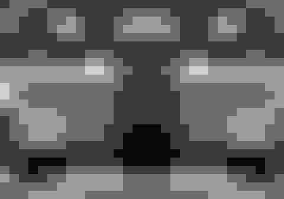
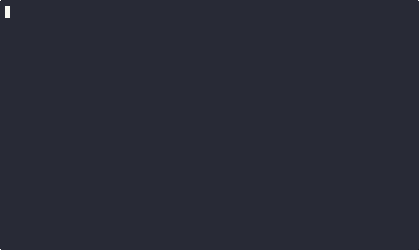

# 🏛️ The Grand Gallery of caffesaver

Welcome to the Grand Gallery of **caffesaver**, a curated collection of terminal screensavers and animated digital art.

Each visualizer in our collection runs either on a high-performance native **C engine** or in **pure Bash**, rendering real-time generative graphics directly in your terminal.

[alpha](#alpha) -
[bouncing](#bouncing) -
[cutesaver](#cutesaver) -
[dunes](#dunes) -
[fireworks](#fireworks) -
[life](#life) -
[matrix](#matrix) -
[perlin-ascii](#perlin-ascii) -
[perlin-pixel](#perlin-pixel) -
[pipes](#pipes) -
[rain](#rain) -
[rorschach](#rorschach) -
[rorschach-led](#rorschach-led) -
[speaky](#speaky) -
[spirograph](#spirograph) -
[stars](#stars) -
[tunnel](#tunnel) -
[vibe](#vibe)

---

## [alpha](./alpha/)

*random colorful pixels*

**Description:** A minimalist screensaver that slowly fills the screen with a random pattern of colorful pixels. Each character block is placed one at a time, creating a mesmerizing and ever-changing mosaic. Simple, lightweight, and hypnotic.

**Engine:** 🐚 Pure Bash  
**License:** MIT  
**[View Cast](./alpha/alpha.cast)**

---

## [bouncing](./bouncing/)

*bouncing 'O' madness*

**Description:** A tribute to the classic DVD screensavers of yesteryear. Watch as multiple 'O's bounce around the terminal, changing color and direction as they hit the edges.

**Engine:** 🐚 Pure Bash  
**License:** MIT  
**[View Cast](./bouncing/bouncing.cast)**

---

## [cutesaver](./cutesaver/)

*infinite loop of cuteness*

**Description:** An onslaught of adorable ASCII art cycling through charming illustrations.

**Engine:** 🐚 Pure Bash  
**License:** MIT  
**[View Cast](./cutesaver/cutesaver.cast)**

---

## [dunes](./dunes/)

*animated 3D Perlin noise sand dunes*

**Description:** 3D animated topographic waves generated by time-evolving Perlin noise across a warm sandy color gradient.

**Engine:** ⚡ C Native + 🐚 Bash Fallback  
**License:** MIT  

---

## [fireworks](./fireworks/)

*Ooh! Aah! Pretty lights!*

**Description:** Light up your terminal with a dazzling fireworks show. Watch as colorful rockets launch and explode into beautiful shimmering patterns.

**Engine:** 🐚 Pure Bash  
**License:** MIT  
**[View Cast](./fireworks/fireworks.cast)**

---

## [life](./life/)

*cellular automata*

**Description:** Conway's Game of Life simulated live inside your terminal.

**Engine:** 🐚 Pure Bash  
**License:** MIT  
**[View Cast](./life/life.cast)**

---

## [matrix](./matrix/)

*the matrix has you*

**Description:** Enter the Matrix with this digital rain effect. Green characters cascade down your screen with multi-level bright heads and trailing color fades.

**Engine:** ⚡ C Native + 🐚 Bash Fallback  
**License:** MIT  
**[View Cast](./matrix/matrix.cast)**

---

## [perlin-ascii](./perlin-ascii/)

*Perlin noise in ASCII characters*

**Description:** Smooth animated Perlin noise terrain rendered in dynamic ASCII character gradients.

**Engine:** ⚡ C Native + 🐚 Bash Fallback  
**License:** MIT  

---

## [perlin-pixel](./perlin-pixel/)

*Grayscale Perlin noise in sub-pixels*

**Description:** High-density grayscale Perlin noise rendered with Unicode half-block characters for a smooth liquid aesthetic.

**Engine:** ⚡ C Native + 🐚 Bash Fallback  
**License:** MIT  

---

## [pipes](./pipes/)

*an endless pipe maze*

**Description:** Get lost in a labyrinth of colorful, winding pipes. Continuously builds an intricate network of 3D pipes that twist and turn across your terminal.

**Engine:** 🐚 Pure Bash  
**License:** MIT  
**[View Cast](./pipes/pipes.cast)**

---

## [rain](./rain/)

*soothing, gentle rain*

**Description:** Relax and unwind with the calming effect of digital rain. Simulates a gentle downpour with falling droplets and splash physics.

**Engine:** 🐚 Pure Bash  
**License:** MIT  
**[View Cast](./rain/rain.cast)**

---

## [rorschach](./rorschach/)

*generative symmetrical inkblots*

**Description:** Symmetrical inkblot patterns morphing continuously, inspired by psychological projective tests.

**Engine:** 🐚 Pure Bash  
**License:** MIT  

---

## [rorschach-led](./rorschach-led/)

*Rorschach inkblots with vivid LED accents*

**Description:** Ultra-smooth 60 FPS generative symmetrical inkblots rendered on paper-like backgrounds with glowing orange LED accents.

**Engine:** ⚡ C Native + 🐚 Bash Fallback  
**License:** MIT  

---

## [speaky](./speaky/)

*dramatic talking screensaver*

**Description:** Uses Text-to-Speech to deliver a dramatic, humorous monologue of existential phrases with randomized positions and voices.

**Engine:** 🐚 Pure Bash  
**License:** MIT  
**[View Cast](./speaky/speaky.cast)**

---

## [spirograph](./spirograph/)

*generative spirograph art*

**Description:** Generative geometric wireframe curves rendered progressively in monochrome sub-pixels.

**Engine:** 🐚 Pure Bash  
**License:** MIT  
**[View Cast](./spirograph/spirograph.cast)**

---

## [stars](./stars/)

*twinkling starfield*

**Description:** Gaze into the cosmos with this peaceful starfield simulation generating twinkling stars across the night sky.

**Engine:** 🐚 Pure Bash  
**License:** MIT  
**[View Cast](./stars/stars.cast)**

---

## [tunnel](./tunnel/)

*fly into the digital tunnel*

**Description:** Fly through a high-speed digital hyperspace warp tunnel with expanding concentric shapes.

**Engine:** 🐚 Pure Bash  
**License:** MIT  
**[View Cast](./tunnel/tunnel.cast)**

---

## [vibe](./vibe/)

*vibe coding*

**Description:** Retro terminal simulation of real-time "vibe coding" and AI interactions.

**Engine:** 🐚 Pure Bash  
**License:** MIT  
**[View Cast](./vibe/vibe.cast)**
